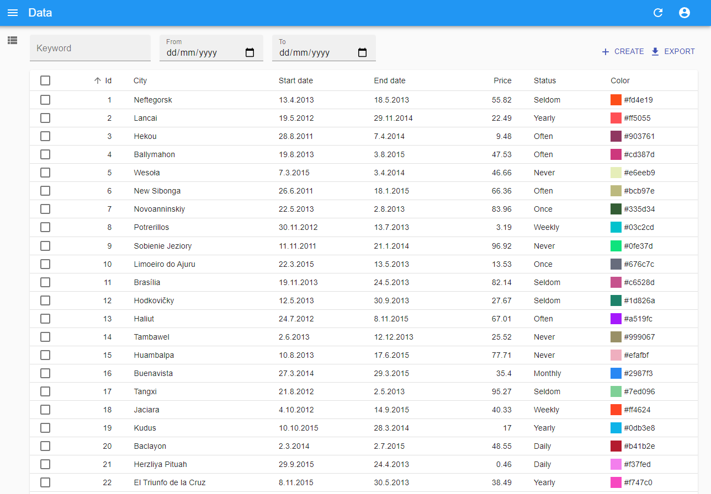
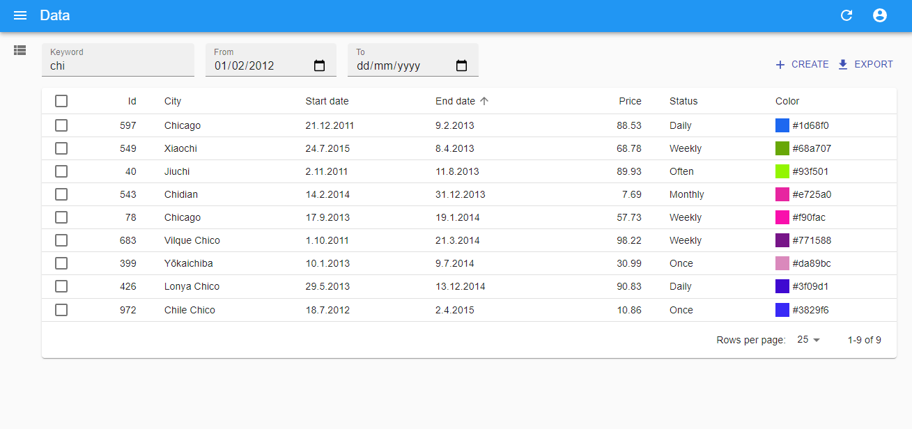
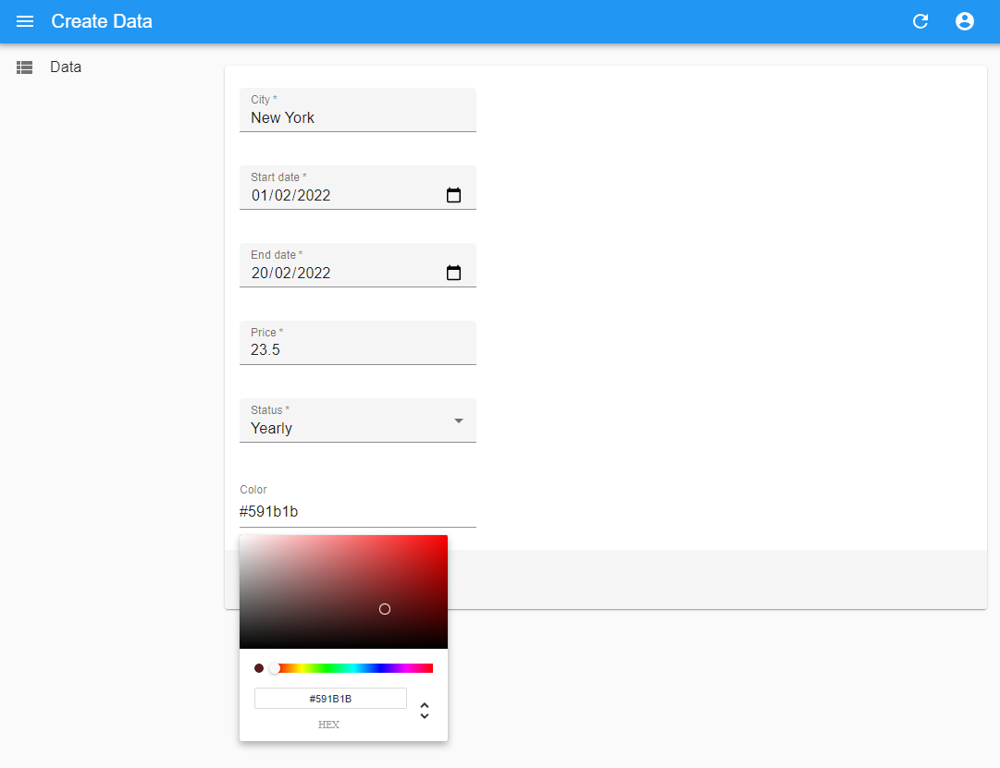
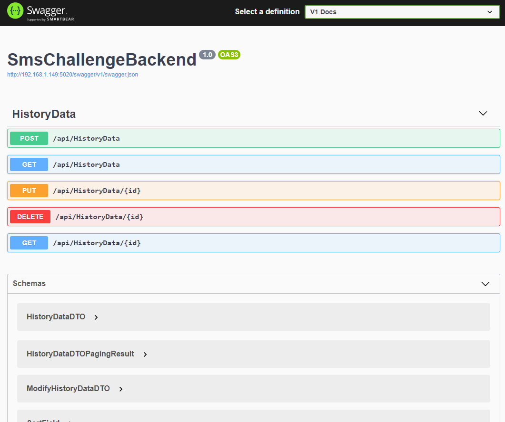

# Solution for SMS fullstack challenge

### This projcet is implemented as a solution for the challenge provided in [here](./mission/README.md).

## Solution

1. A `postgres` database server is created within a docker container and is then filled with the data provided as a `json` file using a `python` script.
2. A `.net Core` application is running as the backend engine to provide a RESTful interface together with their swaggerUI documentations.
3. A `react-admin` frontend is implemented to present the data in a sortable table.
4. Two Date pickers and a Search box is added to filter the data. (the filter is applied server-side)

## Screen Shots

| Start     |
|-----------|
||

| Filtered Result |
|-----------|
||

| Creating a new Data |
|-----------|
||

| Swagger Documentation |
|-----------|
||

## Structure

## How to run

#TODO:
BACKEND TESTS
FRONTEND TESTS
DOCKERFILE
REMOVE THIS TODO